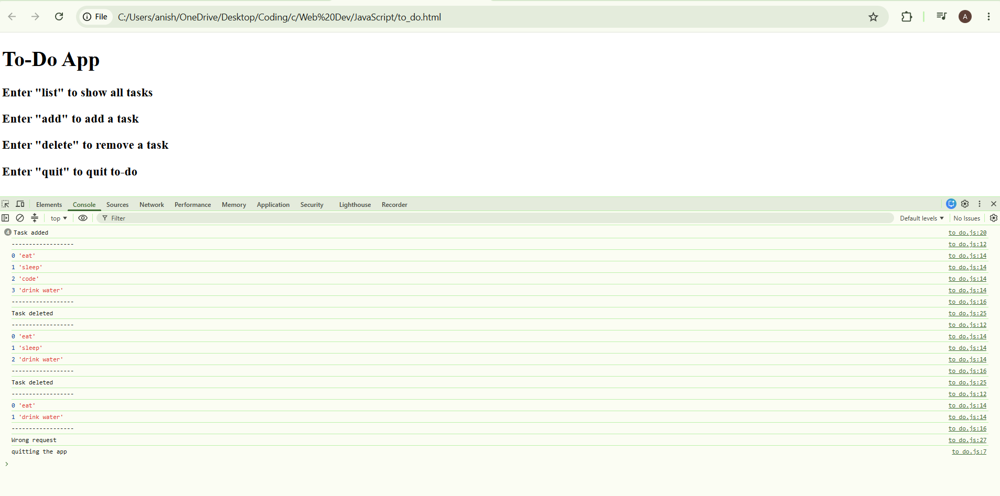

# To-Do App using JavaScript

A simple beginner-friendly To-Do App created using HTML and JavaScript.

## 📌 About the Project

This project is a basic To-Do application that runs using browser prompts and the console. Users can add tasks, view all tasks, delete tasks by index number, and quit the app by entering specific commands.

## How to Run
- Download or clone this repository.
- Open todo.html in your browser.
- Enter commands in the prompt box:
   * list to show all tasks
   * add to add a new task
   * delete to remove a task
   * quit to stop the app
- Open the browser console to see the output.

  
## Commands Used in App
add
list
delete
quit

## Concepts Practiced
JavaScript Arrays
prompt()
while Loop
if-else Conditions
for Loop
push() Method
splice() Method
Console Output

## Preview

## Demo Link
 https://anisha11-star.github.io/To-Do-app/

